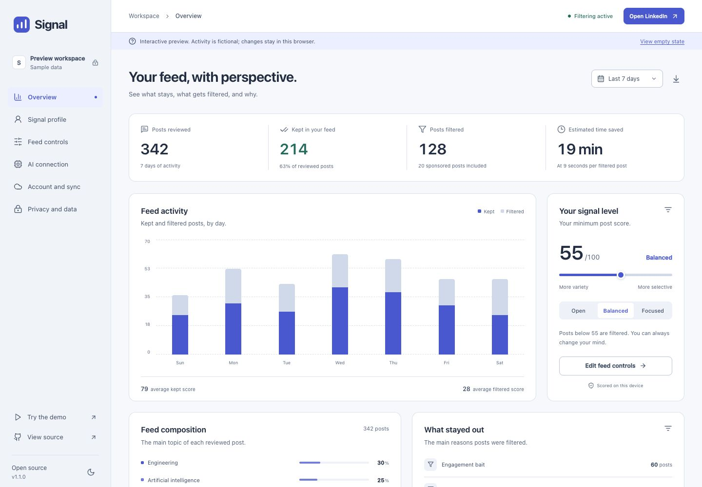

# Signal

Signal is an open-source Chrome extension that scores visible LinkedIn posts against your interests, explains each decision, and filters low-value content from your feed.

It works offline by default. Account sync and external AI analysis are optional.

[Live preview](https://hithere-devs.github.io/signal-linkedin/app/dashboard.html) · [Website](https://hithere-devs.github.io/signal-linkedin/) · [Download](https://github.com/hithere-devs/signal-linkedin/releases/latest)



The web preview uses fictional activity and separate website-local storage. It does not read LinkedIn, connect to cloud accounts, or send AI requests. Install the extension to filter your actual feed.

## What it does

- Scores posts from 0 to 100 using relevance, information density, actionability, originality, evidence, technical depth, and career value.
- Penalizes low-information personal stories, promotional posts, and engagement bait.
- Supports Collapse, Hide, Blur, and Score-only modes.
- Detects and removes sponsored content.
- Shows reasons and classification details on every score badge.
- Learns from show, hide, and feedback actions.
- Tracks local feed statistics and estimated time saved.
- Includes a 7, 14, or 30-day dashboard with daily CSV export and honest empty states.
- Pauses filtering without losing your preferences.
- Provides light and dark themes, keyboard controls, and a responsive settings workspace.
- Syncs profile settings across browsers through an optional Supabase account.
- Supports optional OpenAI-compatible providers, including local Ollama and LM Studio servers.

Signal is independent and is not affiliated with LinkedIn or Microsoft.

## Install from source

Requirements: Node.js 20 or newer, npm, and Chrome 116 or newer.

```bash
git clone https://github.com/hithere-devs/signal-linkedin.git
cd signal-linkedin
npm ci
npm run build
```

Then:

1. Open `chrome://extensions`.
2. Enable Developer mode.
3. Choose **Load unpacked**.
4. Select the generated `dist/` directory.
5. Open `https://www.linkedin.com/feed/`.

The signed Chrome Web Store link will be added after review.

## Use Signal

Open the toolbar popup to choose a score threshold and filtering mode. Open Settings to describe your role, skills, interests, target companies, career goals, and topics to avoid.

The local heuristic scorer works without an account or network request. When AI analysis is enabled, Signal requests access to the exact provider host and sends only posts selected for deeper analysis. Images are sent only when Vision is enabled separately.

Profile and AI configuration changes are saved explicitly. Feed controls save as you change them. Press Command or Ctrl + S in the profile editor to save. Refresh an open LinkedIn feed after changing your profile to rescore existing posts.

Time saved assumes 9 seconds per filtered post. Ads are included in the filtered count, not counted twice. New statistics use your device's calendar date; earlier records keep their original date keys.

## Optional account sync

Account sync stores your profile, preferences, feedback, post overrides, and up to 30 days of aggregate statistics. It does not sync AI keys, cached post text, or AI responses.

Self-hosters can configure Supabase by following [`docs/CLOUD_SETUP.md`](docs/CLOUD_SETUP.md). Official release builds receive the project URL and public anon key through GitHub Actions secrets.

## Privacy and security

- No analytics, ads, tracking pixels, or remote executable code.
- Local data is stored in `chrome.storage.local`.
- AI keys are excluded from exports and cloud sync.
- Required host access is limited to LinkedIn.
- Cloud and AI hosts are optional permissions requested when a user enables those features.
- Supabase row-level security restricts synced state to its authenticated owner.

Read the full [Privacy Policy](PRIVACY.md), [Security Policy](SECURITY.md), and [Terms](TERMS.md).

## Architecture

The extension uses Manifest V3, React, TypeScript, and esbuild.

Visible posts pass through three stages:

1. A cached result is reused when available.
2. Local heuristics score every uncached post.
3. Ambiguous posts can be sent to an optional configured AI provider, with two requests allowed at once and a 20-second timeout.

The content script uses semantic and legacy LinkedIn selectors, a mutation observer for infinite scroll, batched rendering, and Shadow DOM isolation. The service worker owns storage, scoring orchestration, account sessions, and sync.

## Development

```bash
npm run dev          # rebuild on changes
npm run preview      # build and start a local preview server
npm run preview:site # serve the website and public workspace preview
npm run typecheck    # strict TypeScript check
npm test             # unit tests
npm run check        # types, tests, production dependency audit
npm run package      # verify and create a versioned store ZIP plus SHA-256
npm run build:site   # build the public site into site-dist/
npm run verify:site  # check the built site and its local links
npm run format       # format source, tests, scripts, and site files
```

Release artifacts are written to `release/`. Production builds are cleaned before each build and the manifest version is read from `package.json`.

The local preview server listens on `http://127.0.0.1:4317`. Use `PORT=4318 npm run preview:site` if you're running both previews. The public-site build never loads `.env` or includes the extension's background worker. GitHub Pages deploys `site-dist/` after its own type and test checks.

See [DESIGN.md](DESIGN.md) for shared UI rules and [docs/FUNCTIONALITY.md](docs/FUNCTIONALITY.md) for implemented workflows and deliberately deferred features.

## Repository map

```text
public/                 Manifest, HTML shells, generated icons
src/ai/                 Heuristic and optional LLM scoring
src/background/         MV3 service worker and message routing
src/cloud/              Supabase authentication and state sync
src/content/            LinkedIn extraction, filtering, and badges
src/popup/              Toolbar controls
src/settings/           Profile, provider, account, and data controls
src/dashboard/          Feed insights and CSV export
src/ui/                 Shared components, themes, and workspace state
src/preview/            Isolated fictional data for the web preview
src/demo/               Interactive demo using the real post badges
supabase/migrations/    Row-level-secured cloud schema
site/                   GitHub Pages product and policy site
tests/                  Unit tests
```

## Contributing

See [CONTRIBUTING.md](CONTRIBUTING.md). Bug reports and focused pull requests are welcome. Never include private feed content, API keys, or authentication tokens in an issue or commit.

## License

MIT

The public site's Manrope font is distributed under the [SIL Open Font License](site/assets/fonts/OFL.txt). The extension UI uses local system fonts.
